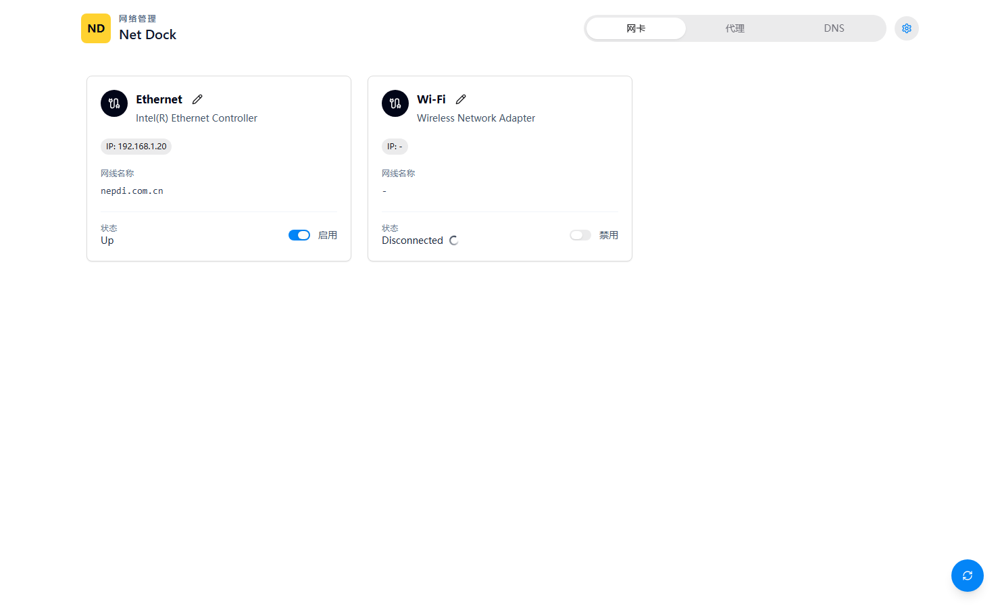

# Net Dock

[简体中文](docs/README.zh-CN.md)

Net Dock is a Windows desktop network utility built with Tauri. It focuses on day-to-day adapter switching, network status inspection, DNS control, and VPN operations.

> Status: actively iterating. Some DNS and VPN workflows are still marked as WIP in the app.



## Features

- View Windows network adapters with status, IPv4 address, and connection-specific DNS suffix.
- Enable or disable adapters with an inline switch.
- Rename adapters directly from each adapter card.
- Auto-refresh adapter status during transient states such as `Disconnected`.
- Manually refresh the current view from a floating refresh button.
- Switch UI language between English and Simplified Chinese.
- Read IPv4 DNS configuration.
- Set static DNS servers or restore automatic DNS.
- Read saved Windows VPN profiles.
- Connect or disconnect saved VPN profiles.
- Request administrator permission on launch for network operations.

## Install

Download the portable Windows zip from the GitHub Releases page, unzip it, and run `net-dock.exe`.

Adapter, DNS, and VPN operations usually require administrator permission. Net Dock requests Windows UAC elevation when it starts.

## Development

This project uses Tauri v2, Vite, React, TypeScript, and Rust.

```powershell
npm install
npm run tauri dev
```

Build a portable executable:

```powershell
npm run tauri -- build --no-bundle
```

Build an installer when NSIS or WiX is available:

```powershell
npm run tauri -- build --bundles nsis
```

## Notes

Net Dock currently uses PowerShell commands such as `Get-NetAdapter`, `Get-NetIPAddress`, `Get-DnsClient`, and `Rename-NetAdapter` behind the Tauri backend. The adapter status auto-refresh path uses a lighter status-only query to reduce refresh overhead.
